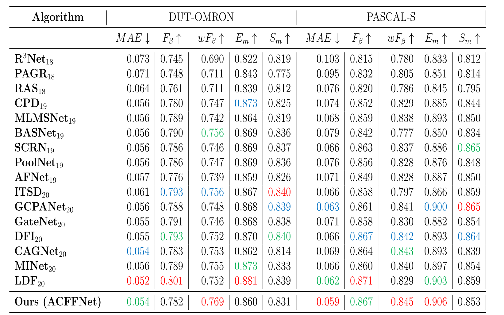

# Attention-Guided-Contextual-Feature-Fusion-Network-for-Salient-Object-Detection
This repo. is an implementation of ACFFNet (Attention guided contextual feature fusion network for salient object detection), which is accepted for in Image and Vision Computing.

## Paper
The paper can be found [here](https://www.sciencedirect.com/science/article/abs/pii/S0262885621002420)

## Saliency maps
you can find the saliency maps on DUTS-TE、ECSSD、HKU-IS、DUT-OMRON and PASCAL-S datasets and the weight pth file from Google Driver link [here](https://drive.google.com/drive/folders/1D9rKUAeMoRBqcm5_R5ZoRmmqXvHV-M3a?usp=sharing) and the Baidu online disk link (The extraction code is: ACFF) [here](https://pan.baidu.com/s/1lRbHrxiF013LWOw-4eXB4Q)

We use the code provided by this [repo.](https://github.com/Mehrdad-Noori/Saliency-Evaluation-Toolbox) to calculate the metrics

## Results
The effect of ACFFNet on 5 benchmark datasets is as follows：

